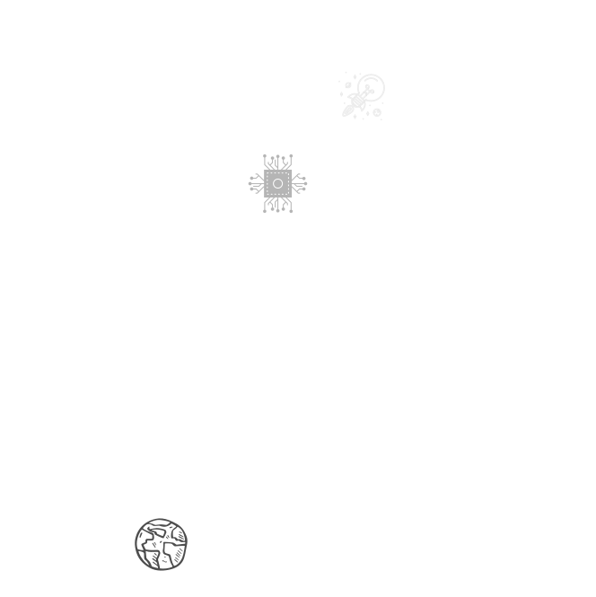

  

<h1 align="center">
  
</h1>

  

<h1 align="center">
  
</h1>

  

  

 
  <a href="https://www.x.com/sayh3x" target="_blank" rel="noreferrer">
    <picture>
      <source media="(prefers-color-scheme: dark)" srcset="https://raw.githubusercontent.com/danielcranney/readme-generator/main/public/icons/socials/twitter-dark.svg" />
      <source media="(prefers-color-scheme: light)" srcset="https://raw.githubusercontent.com/danielcranney/readme-generator/main/public/icons/socials/twitter.svg" />
      
    </picture>
  </a>

